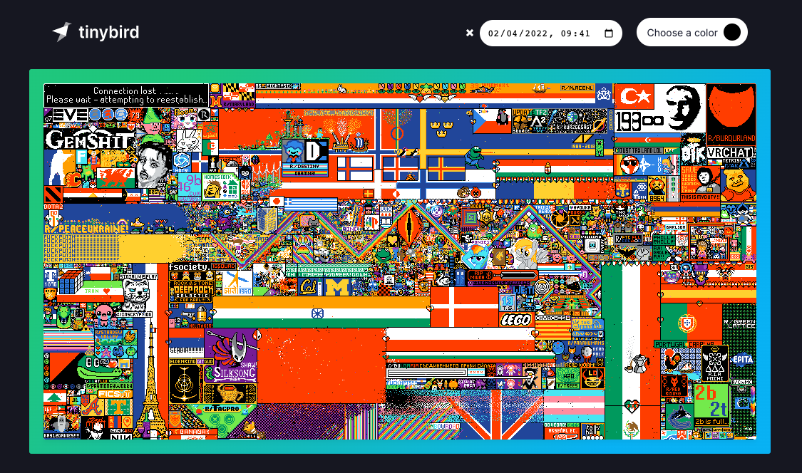

# r/place with Tinybird

This project creates a replica of the r/place canvas. Several people can collaborate together drawing in the canvas from a web browser.

Alternatively you can go at any point in time to the original 2022 r/place canvas.

## How to run

- Go to https://tinybird.co and `SIGN UP`
- Go to the `data_project` directory in this repository and follow the `README.md` instructions to configure the Tinybird workspace.

- Create an `.env` file with a `VITE_TB_TOKEN` variable filled with your Tinybird token workspace.
- Run `npm install` and then `npm run dev`

- Go to `localhost:3000` in your browser and play!
